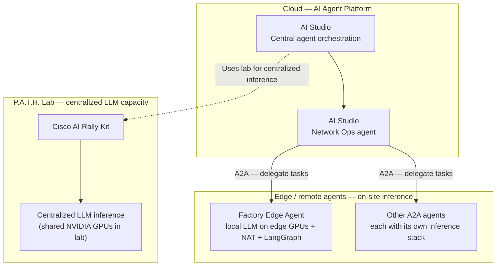
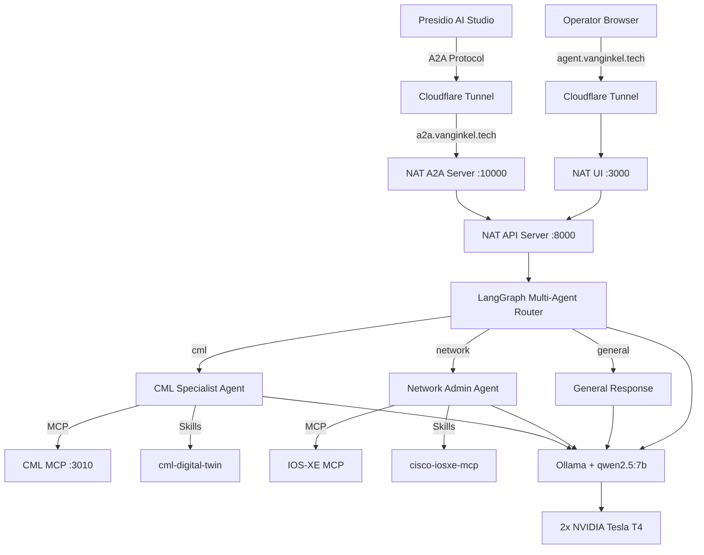
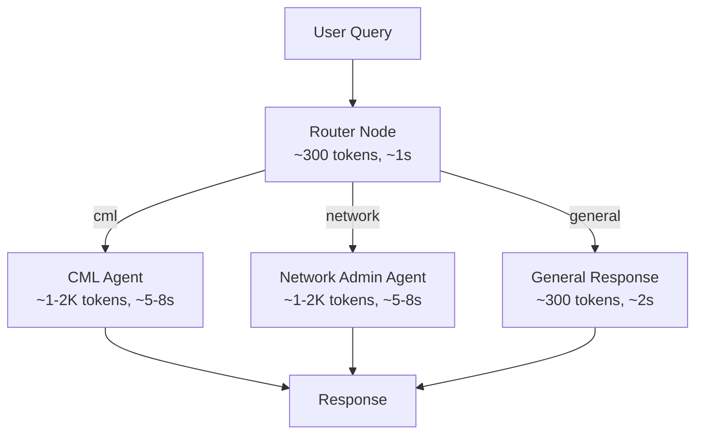
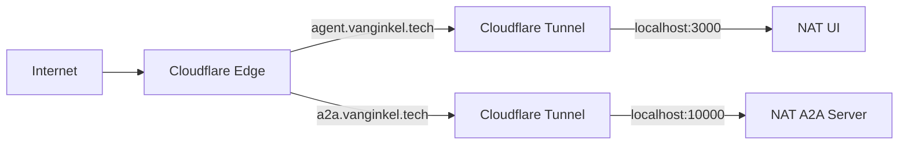

# Factory Edge Agent — NVIDIA + Cisco + Presidio

A remote AI agent running on-premises with local LLM inference, designed to execute infrastructure management tasks across Cisco network environments. Communicates with external orchestration platforms via the Agent-to-Agent (A2A) protocol, secured through Cloudflare Zero Trust tunnels.

Built for the NVIDIA booth at Cisco Live 2026.

---

## AI Studio orchestration and A2A delegation

**Presidio AI Studio** is the central **AI Agent Platform** in the cloud: it coordinates agents and workflows. The **P.A.T.H. Lab** is **not** “local” in the sense of a customer site—it is **centralized lab infrastructure**: **Cisco AI Rally Kit** with **NVIDIA GPUs** provides **centralized LLM inference** that AI Studio can use for shared or lab-hosted workloads. Separately, **edge agents** such as this **Factory Edge Agent** run a **local LLM on their own on-site GPUs** (e.g. Ollama on T4s at the deployment site) so sensitive tool calls and data stay at that site. The **AI Studio Network Ops agent** delegates infrastructure and network tasks to those **edge / remote agents** over the **Agent-to-Agent (A2A)** protocol.



The diagram below zooms into the **Factory Edge Agent** stack (tunnels, NAT, LangGraph, **on-site** Ollama + MCP).

---

## End Goal

Act as a **remote autonomous agent** with:
- **Local LLM inference** on NVIDIA GPUs — sensitive infrastructure data never leaves the site
- **MCP tool integration** for Cisco infrastructure management (CML, IOS-XE, Splunk, ThousandEyes)
- **Anthropic Agent Skills** for complex multi-step workflows (digital twin creation, incident response)
- **A2A protocol exposure** so Presidio AI Studio can delegate tasks to this agent remotely
- **NVIDIA-branded UI** for direct human interaction



---

## Hardware Profile

| Component | Details |
|-----------|---------|
| **Server** | Cisco UCS C220 M5 |
| **Hypervisor** | Proxmox with LXC container |
| **GPUs** | 2x NVIDIA Tesla T4 (16GB VRAM each, 32GB total) |
| **GPU Passthrough** | Via Proxmox to LXC container |
| **OS** | Debian (inside LXC) |
| **Container Runtime** | Docker CE with NVIDIA Container Toolkit |
| **Server IP** | Private LAN (behind Cloudflare tunnel) |

---

## NVIDIA Components

| Component | Role |
|-----------|------|
| **NVIDIA NeMo Agent Toolkit (NAT)** | API server (`nat serve`), A2A gateway (`nat a2a serve`), wraps the LangGraph agent |
| **nvidia-nat-langchain** | Plugin enabling NAT to wrap existing LangGraph agents via `langgraph_wrapper` |
| **NeMo Agent Toolkit UI** | NVIDIA-branded Next.js chat frontend with intermediate step visualization |
| **NVIDIA Tesla T4 GPUs** | Local LLM inference via Ollama — all data stays on-premises |
| **LangSmith/LangGraph** | Agent tracing, visualization, and evaluation |

---

## Agent Architecture

### Why Multi-Agent Routing

A single agent with all tools (20+ MCP tool definitions) creates a massive prompt that takes 20+ seconds to process on the T4 GPUs. The multi-agent routing architecture keeps each LLM call's context small and fast.



- **Router**: Zero tools. Tiny prompt with agent names and descriptions. Classifies the request in ~1 second.
- **CML Specialist**: Only CML MCP tools + CML digital twin skill. Handles lab management, topology creation, digital twin workflows.
- **Network Admin Specialist**: Only IOS-XE MCP tools + network admin skill. Handles device configuration, routing, ACLs.
- **General**: No tools. Answers meta-questions about available capabilities using the agent registry.

### Skills (Anthropic Agent Skills Specification)

Skills follow the [agentskills.io](https://agentskills.io/specification) three-level progressive loading:

1. **Level 1 — Discovery**: Only `name` + `description` from SKILL.md frontmatter loaded at startup (~100 tokens per skill)
2. **Level 2 — Activation**: Agent calls `activate_skill` tool to load full SKILL.md body when a complex task matches a skill
3. **Level 3 — Execution**: Agent calls `read_skill_reference` tool to load files from the skill's `references/` directory on demand

This keeps prompt context minimal for simple queries while providing full procedural knowledge for complex workflows.

---

## LLM Benchmark Data

Testing was performed on the multi-agent routing architecture with the following models:

### qwen2.5:7b (current production model)

| Query | Tokens | Latency |
|-------|--------|---------|
| "What tools are available?" (general route) | 607 | 8.83s |
| "How many tools do you have?" (CML route, tool introspection) | 6,947 | 18.73s |
| "What labs are running in CML?" (CML route, MCP tool call) | 14,057 | 16.95s |

### Models Evaluated

| Model | Size | Context | Tool Calling | Result |
|-------|------|---------|--------------|--------|
| **qwen3:8b** | ~5GB | 128K | Yes | Thinking mode generates hundreds of hidden tokens. 30-40s per call. Rejected. |
| **qwen2.5:7b** | ~4.5GB | 128K | Reliable | Follows instructions, no thinking overhead. Selected as production model. |
| **phi4-mini:3.8b** | ~2.5GB | 128K | Yes | Fast inference but ignores system prompt constraints. Hallucinated capabilities instead of listing actual tools. Rejected. |
| **nemotron-mini:4b** | ~2.5GB | **4K** | Unreliable (~50%) | NVIDIA's model, but 4K context too small for tool definitions. Tool calling outputs raw XML instead of proper function calls ~50% of the time. Rejected. |

### Key Lessons Learned

- **Prompt size is the bottleneck, not GPU power.** T4s process ~250-350 tokens/sec for prefill. A 5K token prompt = ~15-20s just for prefill.
- **`create_deep_agent` was the wrong starting point.** It creates a planner that makes 3-5 sequential LLM calls per request, each processing the full prompt. Replaced with multi-agent routing using `create_react_agent` per specialist.
- **Model routing reduces per-call context by 3-4x.** Router sees ~300 tokens. Specialists see ~1-2K tokens (only their own tools) vs. a monolithic agent seeing 5.7K+ tokens.
- **Qwen3's "thinking mode" generates invisible tokens** that waste inference time. Even with `reasoning_effort: none`, the model was unreliable. Qwen2.5:7b avoids this entirely.
- **Small models hallucinate under constraints.** phi4-mini and nemotron-mini both failed to follow system prompt instructions reliably. 7B parameter models are the minimum for consistent tool calling and instruction following on this hardware.

---

## Secure External Access (Cloudflare Zero Trust)

The agent is exposed to the internet through Cloudflare Tunnels with Zero Trust access policies. No ports are opened on the server's firewall.



| Endpoint | URL | Backend | Auth |
|----------|-----|---------|------|
| **NAT UI** | `https://agent.vanginkel.tech` | `localhost:3000` | Cloudflare Access (SSO) |
| **A2A Gateway** | `https://a2a.vanginkel.tech` | `localhost:10000` | Bearer token (`A2A_BEARER_TOKEN` in `.env`) |

The A2A endpoint accepts JSON-RPC requests following the A2A protocol specification. The agent card is available at `https://a2a.vanginkel.tech/.well-known/agent.json`.

---

## Service Management

All services are managed via systemd.

### Start/Stop All Services

```bash
sudo systemctl start demo-agent.target    # Start all
sudo systemctl stop demo-agent.target     # Stop all
```

### Individual Services

| Service | Command | Port |
|---------|---------|------|
| **NAT API Server** | `sudo systemctl restart nat-serve` | 8000 |
| **NAT A2A Server** | `sudo systemctl restart nat-a2a` | 10000 |
| **NAT UI** | `sudo systemctl restart nat-ui` | 3000 |

### Health Checks

```bash
# Service status
systemctl status nat-serve nat-a2a nat-ui

# Port verification
ss -tlnp | grep -E ':(3000|8000|10000) '

# NAT API health
curl http://localhost:8000/health

# View logs
sudo journalctl -u nat-serve -f --no-pager -n 50

# GPU utilization
nvidia-smi

# Ollama model status
docker exec ollama ollama ps
```

---

## How to Add a New MCP Tool Server

1. **Start the MCP server** as a Docker container:

```bash
docker run -d \
  -p <PORT>:<PORT> \
  -e <CONFIG_VARS> \
  --name <server-name> \
  --restart unless-stopped \
  <image>
```

2. **Add the MCP server to the agent registry** in `/opt/demo-agent/agent.py`:

```python
AGENT_REGISTRY = {
    # ... existing agents ...
    "new_agent_name": {
        "description": "Description of what this agent does",
        "mcp": {
            "server_name": {
                "transport": "streamable_http",
                "url": os.getenv("NEW_MCP_URL", "http://localhost:<PORT>/mcp"),
            },
        },
        "skill_dirs": ["skill-directory-name"],  # optional
    },
}
```

3. **Add the specialist node** in the `build_agent()` function:

```python
async def new_agent_node(state):
    result = await specialists["new_agent_name"].ainvoke({"messages": state["messages"]})
    return {"messages": result["messages"]}

graph.add_node("new_agent_name", new_agent_node)
```

4. **Add the routing edge** — update the `conditional_edges` dict to include the new agent name.

5. **Add routing examples** to `ROUTER_PROMPT`:

```python
- "relevant query example" -> new_agent_name
```

6. **Restart**:

```bash
sudo systemctl restart nat-serve
```

---

## How to Add a New Skill

Skills follow the [Anthropic Agent Skills specification](https://agentskills.io/specification).

1. **Create the skill directory** under `/opt/demo-agent/skills/`:

```
/opt/demo-agent/skills/my-new-skill/
├── SKILL.md              # Required: metadata + instructions
└── references/           # Optional: documentation loaded on demand
    ├── api-guide.md
    └── examples.md
```

2. **Write the SKILL.md** with YAML frontmatter:

```markdown
---
name: my-new-skill
description: What this skill does and when to use it. Include keywords for agent discovery.
---

# My New Skill

## Overview
What this skill accomplishes.

## Procedure
1. Step one — call tool X with parameters Y
2. Step two — read reference file Z for configuration details
3. Step three — execute the workflow

## Reference Files
- `api-guide.md` — API documentation for the target system
- `examples.md` — Example configurations and expected outputs
```

3. **Map the skill to an agent** in `AGENT_REGISTRY`:

```python
"agent_name": {
    "skill_dirs": ["my-new-skill"],
    ...
}
```

4. **Restart**:

```bash
sudo systemctl restart nat-serve
```

The agent will log `[AGENT_NAME] Loaded 1 skills: ['my-new-skill']` on startup.

---

## File Structure

```
/opt/demo-agent/
├── agent.py              # Multi-agent LangGraph graph (router + specialists)
├── nat-config.yml        # NAT configuration (LLM + langgraph_wrapper)
├── .env                  # Environment variables (model, API keys, tokens)
├── langgraph.json        # LangGraph dev server config (visualization only)
├── skills/
│   ├── cml-digital-twin/
│   │   ├── SKILL.md
│   │   └── references/
│   └── cisco-iosxe-mcp/
│       ├── SKILL.md
│       └── references/
└── nat-ui/               # NVIDIA NeMo Agent Toolkit UI (Next.js)
    └── .env              # UI configuration (branding, backend URL)
```

### Systemd Units

```
/etc/systemd/system/
├── nat-serve.service     # NAT API Server (wraps LangGraph agent)
├── nat-a2a.service       # NAT A2A Server (A2A protocol gateway)
├── nat-ui.service        # NVIDIA NAT UI (Next.js frontend)
└── demo-agent.target     # Group target for all services
```

---

## Docker Containers

| Container | Image | Port | Purpose |
|-----------|-------|------|---------|
| **ollama** | `ollama/ollama:latest` | 11434 | LLM inference with GPU acceleration |
| **cml-mcp-server** | `ghcr.io/presidio-federal/cml-mcp:latest` | 3010 | Cisco Modeling Labs MCP tools |

---

## LangGraph Studio (Visualization)

For visual graph debugging, run the LangGraph dev server on a separate port:

```bash
cd /opt/demo-agent && /home/.venv/bin/langgraph dev --port 8123 --host 0.0.0.0
```

Then connect LangGraph Studio at `https://smith.langchain.com/studio` pointing to `http://<SERVER_IP>:8123`.

This runs a second instance of the agent for visualization only. Production traffic goes through `nat-serve` on port 8000.

---

## Changing the LLM Model

```bash
# Pull the new model
docker exec ollama ollama pull <model-name>

# Update environment
sed -i 's/^OLLAMA_MODEL=.*/OLLAMA_MODEL=<model-name>/' /opt/demo-agent/.env
sed -i 's/model: .*/model: <model-name>/' /opt/demo-agent/nat-config.yml

# Unload old model and restart
docker exec ollama ollama stop <old-model>
sudo systemctl restart nat-serve

# Verify
docker exec ollama ollama ps
```
